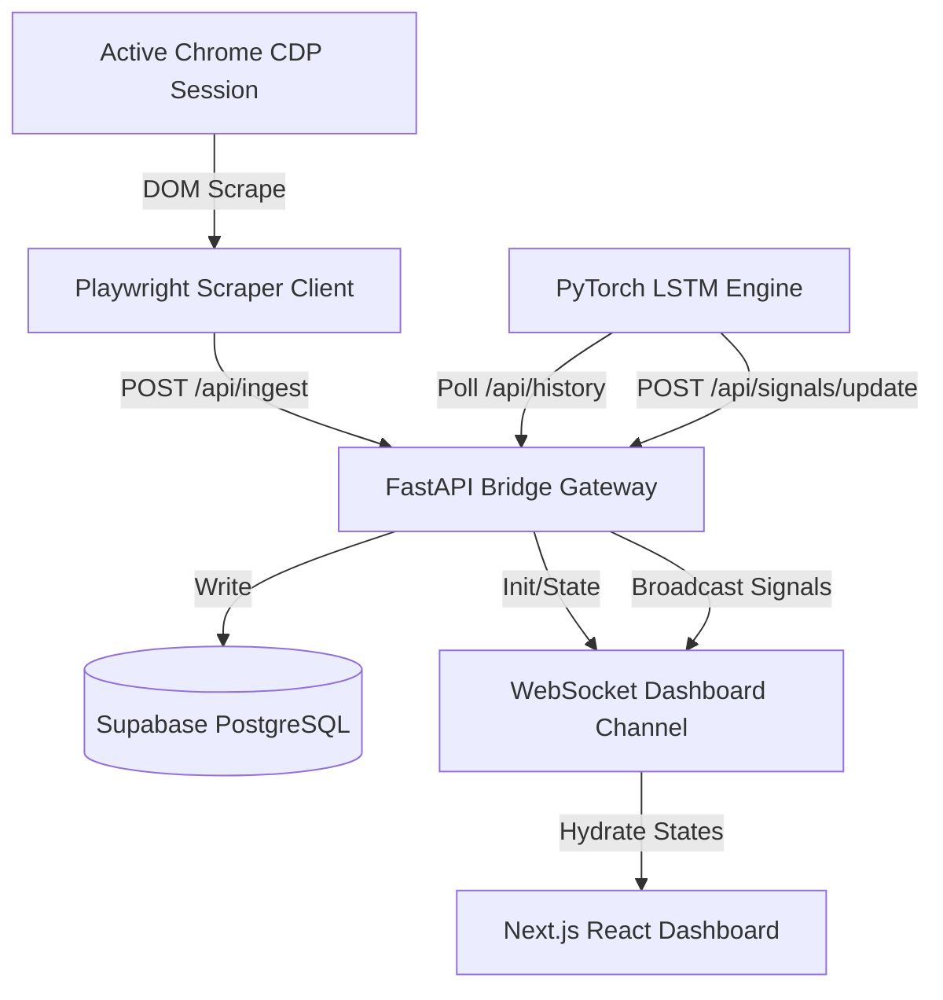

# Aviator Crash Game Analyzer

A real-time predictive analytics system built to scrape Aviator crash multiplier data, record flight telemetry in Supabase, run sequence modeling via a PyTorch LSTM, and stream actionable safety signals to an interactive Next.js dashboard.

---

## Architecture Overview

We structured this system as four decoupled, low-latency microservices:
1. **Continuous Data Scraper (`scraper/`)**: Playwright async controller that connects to Chrome via Chrome DevTools Protocol (CDP), monitors the live game DOM, extracts crash multipliers as rounds resolve, and dispatches them via POST request.
2. **FastAPI backend Gateway (`backend/`)**: Acts as a bridge. It logs ingest data into a Supabase PostgreSQL database, handles WebSocket handshakes to dashboards, and manages LSTM inference signals routing.
3. **LSTM Analytics Engine (`analytics/`)**: PyTorch Recurrent Neural Network (LSTM) that processes log-normal sequences of the last 15 crash multipliers to calculate safety probability ratings for entry signals.
4. **Next.js Dashboard UI (`frontend/`)**: React dark-mode portal displaying Recharts multiplier trends, paginated historical tables, and AI signal alerts.



---

## Tech Stack
* **AI & Sequence Modeling**: Python 3.11, PyTorch, NumPy
* **Data Storage**: Supabase (PostgreSQL)
* **Backend Bridge**: FastAPI, Uvicorn, WebSockets, HTTPX, Pydantic
* **Web Automation**: Playwright (Async Chromium CDP)
* **Frontend Portal**: Next.js 16, TypeScript, Tailwind CSS, Recharts

---

## Step-by-Step Execution Guide

To run the complete pipeline on Windows, launch the following services in separate command prompt windows:

### Step 1: Open Google Chrome in Remote Debugging Mode
Close all active instances of Google Chrome first. Then open a command prompt (`cmd.exe`) and execute the following command to launch a browser session listening on port `9222` with background throttling disabled (this ensures Chrome keeps rendering DOM changes even when minimized or occluded by other windows):
```cmd
"C:\Program Files\Google\Chrome\Application\chrome.exe" --remote-debugging-port=9222 --user-data-dir="C:\chrome-automation-profile" --disable-background-timer-throttling --disable-backgrounding-occluded-windows --disable-renderer-backgrounding
```
*Navigating to the Hollywoodbets Aviator page in this browser session allows the scraper to attach to the live DOM.*

### Step 2: Configure Supabase Credentials
Ensure a `.env` file exists at the root of the project directory (`aviator/.env`) containing:
```env
SUPABASE_URL=https://your-project-id.supabase.co
SUPABASE_KEY=your-supabase-anon-key
```

### Step 3: Launch the FastAPI Backend Service
Open a command prompt in the `backend/` directory and run:
```cmd
..\venv\Scripts\python.exe -m uvicorn app.main:app --host 0.0.0.0 --port 8000 --reload
```
*The backend handles WebSocket client connections and logs crash entries into Supabase.*

### Step 4: Run the LSTM Analytics Engine
Open a command prompt in the `analytics/` directory and run:
```cmd
..\venv\Scripts\python.exe -u main.py
```
*This service pulls telemetry history from the backend, retrains the LSTM weights incrementally, and posts predicted target exits.*

### Step 5: Start the Playwright Web Scraper
Open a command prompt in the `scraper/` directory and run:
```cmd
..\venv\Scripts\python.exe -u main.py
```
*This script attaches to Chrome over port 9222, scans the nested betting frames, and posts multipliers as each flight resolves.*

### Step 6: Launch the Next.js Frontend Dashboard
Open a command prompt in the `frontend/` directory and run:
```cmd
npm run dev
```
Open `http://localhost:3000` in your browser. Switch between **Analytics** (for live charts, health checks, and signals) and **History** (to view paginated chronological flights, limits, and date filters).
