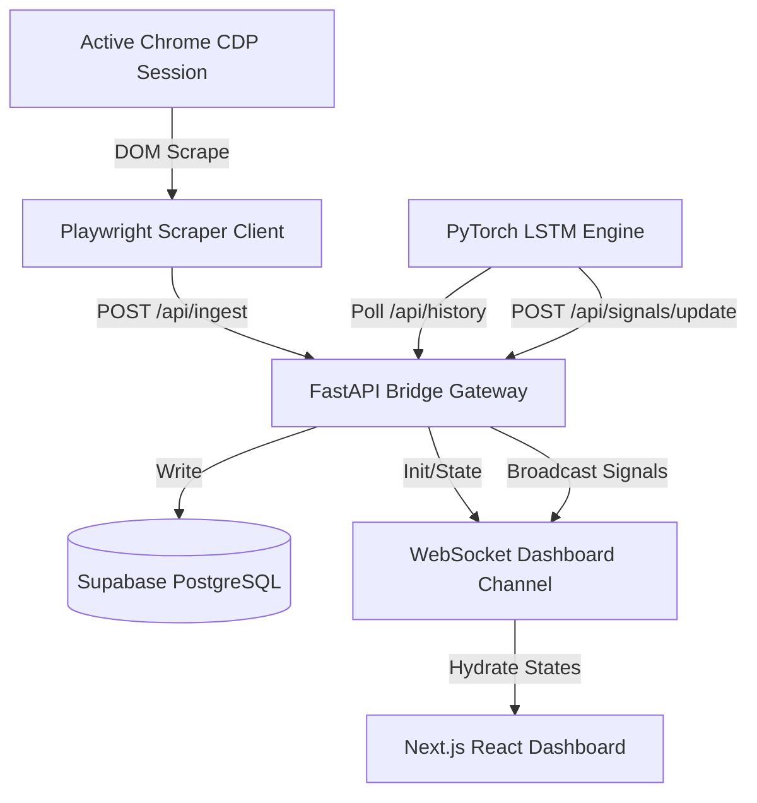

# Aviator Crash Game Analyzer

A real-time predictive analytics system built to scrape Aviator crash multiplier data, record flight telemetry in Supabase, run sequence modeling via a PyTorch LSTM, and stream actionable safety signals to an interactive Next.js dashboard.

---

## Architecture Overview

We structured this system as four decoupled, low-latency microservices:
1. **Continuous Data Scraper (`scraper/`)**: Playwright async controller that connects to Chrome via Chrome DevTools Protocol (CDP), monitors the live game DOM, extracts crash multipliers as rounds resolve, and dispatches them via POST request.
2. **FastAPI backend Gateway (`backend/`)**: Acts as a bridge. It logs ingest data into a Supabase PostgreSQL database, handles WebSocket handshakes to dashboards, and manages LSTM inference signals routing.
3. **LSTM Analytics Engine (`analytics/`)**: PyTorch Recurrent Neural Network (LSTM) that processes log-normal sequences of the last 15 crash multipliers to calculate safety probability ratings for entry signals (supporting a short-term 5-wins strategy).
4. **Next.js Dashboard UI (`frontend/`)**: React dark-mode portal displaying Recharts multiplier trends, paginated historical tables, and AI signal alerts.



---

## Tech Stack
* **AI & Sequence Modeling**: Python 3.11, PyTorch, NumPy
* **Data Storage**: Supabase (PostgreSQL)
* **Backend Bridge**: FastAPI, Uvicorn, WebSockets, HTTPX, Pydantic
* **Web Automation**: Playwright (Async Chromium CDP)
* **Frontend Portal**: Next.js 14, TypeScript, Tailwind CSS, Recharts, Lucide React

---

## Getting Started

### 1. Database Setup
Execute the initialization script inside [20260704000000_init_schema.sql](supabase/migrations/20260704000000_init_schema.sql) in your Supabase SQL editor to create the `crash_history` table and descending index:
```sql
CREATE TABLE public.crash_history (
    id BIGINT GENERATED BY DEFAULT AS IDENTITY PRIMARY KEY,
    multiplier NUMERIC(8, 2) NOT NULL,
    timestamp TIMESTAMP WITH TIME ZONE DEFAULT timezone('utc'::text, now()) NOT NULL,
    created_at TIMESTAMP WITH TIME ZONE DEFAULT timezone('utc'::text, now()) NOT NULL
);
CREATE INDEX idx_crash_history_timestamp ON public.crash_history (timestamp DESC);
```

### 2. Configure Environment Variables
Copy `.env.example` to `.env` at the root of `aviator/` and paste your Supabase credentials:
```env
SUPABASE_URL=https://your-supabase-project-ref.supabase.co
SUPABASE_KEY=your-supabase-anon-key
```

### 3. Launch Services Concurrently

#### Start the FastAPI Server
Navigate to `backend/` and run:
```bash
# Activate virtual environment
.\venv\Scripts\activate
# Start FastAPI gateway
uvicorn app.main:app --reload
```

#### Start the LSTM Analytics Engine
Navigate to `analytics/` and run:
```bash
# Activate virtual environment
.\venv\Scripts\activate
# Start inference polling loops
python main.py
```

#### Run the Playwright Scraper
Ensure Chrome is running with remote debugging port active (`chrome.exe --remote-debugging-port=9222`), then under `scraper/` run:
```bash
# Activate virtual environment
.\venv\Scripts\activate
# Start the DOM scraper
python main.py
```

#### Launch the Next.js Frontend
Navigate to `frontend/` and run:
```bash
npm run dev
```
Open `http://localhost:3000` to monitor predictions, scraper status, and multipliers live.
